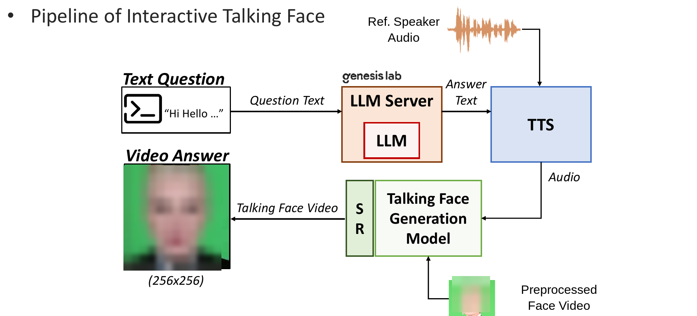
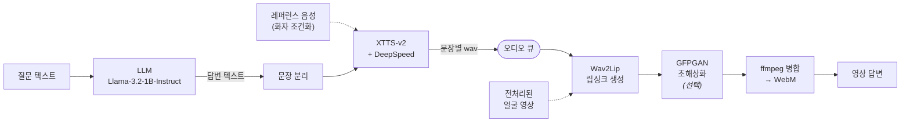

<div align="center">

# LLM-TTS Talking Face

### 실시간 대화형 말하는 아바타 — LLM → TTS → Wav2Lip → 초해상화

텍스트 질문을 받아 **화자의 목소리와 얼굴로 답하는 립싱크 영상**을 생성하는 FastAPI 서빙 파이프라인입니다.
문장 단위로 흘려보내 음성합성과 영상생성이 겹쳐 돌아가도록 설계했습니다.

[](https://www.python.org/)
[](https://fastapi.tiangolo.com/)
[](https://pytorch.org/)
[](https://developer.nvidia.com/cuda-toolkit)
[](https://www.docker.com/)


**[English README →](README.md)**

</div>

---

## 프로젝트 개요

중앙대학교 첨단영상대학원 IRIS Lab에서 수행한 산학협력 과제 **㈜제네시스랩**의 연구 결과로,
2025년 8월 가상융합 심포지엄에서 발표한
*Real-time Interactive Talking Face System with Integrated LLM and TTS* 의 **실시간 서빙 파이프라인 구현체**입니다.

적용 목표는 패션 전시에서 관람객의 질문에 답하는 **대화형 디지털 휴먼**이었습니다.
인물의 외형과 목소리를 복제하는 것에 더해 **실시간으로 응답**해야 했기 때문에,
아래의 지연시간 문제가 이 프로젝트의 핵심 과제가 되었습니다.

<div align="center">

<br>
<sub>심포지엄 발표 당시의 시스템 파이프라인 — 얼굴 마스킹 및 화자 익명화 처리</sub>
</div>

## 시스템 구조

이 저장소는 위 파이프라인의 **서빙 계층**(오케스트레이션·스트리밍·영상 병합)을 구현합니다.
LLM과 Wav2Lip 모델은 별도 서비스로 동작합니다.



## 핵심 문제: 지연시간

단순하게 구현하면 각 단계가 순차적으로 돌아갑니다. 사용자는 **모든 문장의 음성합성이 끝날 때까지**
기다린 뒤에야 영상 생성이 시작되죠. 전체 지연은 두 단계의 **합**이 되고, 답변이 길어질수록 선형으로 늘어납니다.

`main_refine_parallel.py`는 이를 **문장 단위 producer-consumer 파이프라인**으로 재구성했습니다.
TTS 워커 스레드가 완성된 문장을 큐에 넣으면, Wav2Lip consumer가 *n*번째 문장을 처리하는 동안
TTS 워커는 이미 *n+1*번째 문장을 합성하고 있습니다.

```
순차 처리  (main_refine.py)
  LLM  ██
  TTS      ████ ████ ████ ████
  W2L                          ████ ████ ████ ████
                                                   ▲ 응답

병렬 처리  (main_refine_parallel.py)
  LLM  ██
  TTS      ████ ████ ████ ████
  W2L           ████ ████ ████ ████
                                    ▲ 응답
```

체감 시간이 `TTS_전체 + W2L_전체`에서 `max(TTS_전체, W2L_전체) + 마지막 한 구간`에 가깝게 줄어듭니다.
두 단계가 서로 다른 자원(XTTS는 로컬 GPU, Wav2Lip은 원격 API)을 쓰기 때문에 겹쳐도 손해가 없고,
답변이 길수록 이득이 커집니다.

구현에서 신경 쓴 지점입니다.

| 문제 | 해결 |
|---|---|
| 비동기 서버 안의 블로킹 호출 | Wav2Lip consumer는 `run_in_executor`, TTS producer는 `Thread`로 분리해 이벤트 루프를 막지 않음 |
| 스트림 종료 시점 | `(None, None)` 센티널로 큐를 닫아 consumer가 병합 시점을 인지 |
| XTTS 추론 속도 | 체크포인트 로드 시 `use_deepspeed=True` 적용 |
| 화자 동일성 | 서버 기동 시 **여러 개의** 레퍼런스 음성으로 conditioning latent를 한 번만 계산해 전 요청에서 재사용 |
| 브라우저 재생 | 문장별 MP4를 `ffmpeg`로 병합 후 WebM(libvpx)으로 트랜스코딩 |

## API

| 엔드포인트 | 메서드 | 설명 |
|---|:--:|---|
| `/` | GET | 웹 인터페이스 (Jinja2 템플릿) |
| `/health` | GET | 준비 상태 확인 — 모델 로딩 완료 전까지 503 |
| `/tts` | POST | 질문 → 말하는 아바타 영상 |

<details>
<summary><b>POST /tts</b></summary>

**요청**

```json
{
  "text": "오늘 기분이 어때요?",
  "language": "ko",
  "super_resolution": false
}
```

`language`는 XTTS-v2가 지원하는 16개 언어 코드를 받습니다
(`en`, `ko`, `ja`, `zh-cn`, `es`, `fr`, `de`, `it`, `pt`, `pl`, `tr`, `ru`, `nl`, `cs`, `ar`, `hi`).

**응답**

```json
{
  "status": "success",
  "video_url": "/outputs/result_1724220000.mp4",
  "llm_response": "덕분에 아주 좋아요!",
  "processing_times": { "llm": 0.41, "wav2lip": 3.87, "total": 4.28 }
}
```

매 호출마다 단계별 처리 시간을 반환하므로, 순차 서버와 병렬 서버를 같은 하드웨어에서 직접 비교할 수 있습니다.

</details>

## 서버 구성

| 진입점 | 파이프라인 | 용도 |
|---|---|---|
| `main.py` | 웹 UI와 스트리밍 엔드포인트를 포함한 전체 서버 | 초기 구현 |
| `main_refine.py` | 순차: LLM → TTS 전체 → Wav2Lip 전체 | 지연시간 비교용 베이스라인 |
| `main_refine_parallel.py` | **병렬**: 문장 단위 producer-consumer | 권장 |

## 실행 방법

### Docker

```bash
docker build -t llm-tts-talking-face .
docker run --gpus all -p 8000:8000 \
  -e HF_TOKEN=<발급받은_HF_토큰> \
  -e WAV2LIP_HOST=<호스트:포트> \
  llm-tts-talking-face
```

### 환경변수

| 변수 | 필수 | 설명 |
|---|:--:|---|
| `HF_TOKEN` | ✅ | Hugging Face 토큰 — 서버 기동 시 로그인해 접근 제한된 Llama-3.2 가중치를 받아옵니다 |
| `WAV2LIP_HOST` | ✅ | Wav2Lip 추론 서비스의 호스트·포트 (예: `10.0.0.5:8000`) |

XTTS-v2는 최초 실행 시 자동으로 다운로드됩니다.

### 로컬

```bash
pip install -r requirements.txt
huggingface-cli login
export WAV2LIP_HOST=<호스트:포트>
python main_refine_parallel.py          # 8000번 포트
```

이후 `http://localhost:8000` 접속.

### 요구 사항

- Python 3.10+, CUDA 12.1+ GPU
- `libvpx`가 포함된 `ffmpeg` (WebM 출력용)
- `WAV2LIP_HOST`가 가리키는 **Wav2Lip 추론 API** 접근 가능해야 합니다.
  이 저장소는 오케스트레이션 계층이며, Talking Face 모델은 별도 서비스로 동작합니다.

## 프로젝트 구조

```
llm-tts-talking-face/
├── main.py                      # 전체 서버 (웹 UI + 스트리밍)
├── main_refine.py               # 순차 처리 베이스라인
├── main_refine_parallel.py      # 병렬 producer-consumer 서버
├── utils/                       # 순차 경로 설정
│   ├── llm_config.py                # Llama 로딩 및 프롬프트 구성
│   ├── xtts_config.py               # XTTS 초기화, 화자 조건화, 합성
│   ├── wav2lip_config.py            # Wav2Lip API 클라이언트
│   └── utils.py                     # 로깅, 경로, WebM 변환
├── utils_parallel/              # 병렬 경로 설정
│   ├── xtts_config.py               # 큐에 문장을 밀어넣는 합성
│   └── wav2lip_config.py            # 큐를 소비하는 영상 생성 + ffmpeg 병합
├── client.py / wav2lip_client.py    # 요청 클라이언트
├── templates/index.html         # 웹 인터페이스
├── input/                       # 샘플 레퍼런스 음성
└── Dockerfile
```

## 사용 모델

| 단계 | 모델 | 출처 |
|---|---|---|
| 언어모델 | Llama-3.2-1B-Instruct | Meta |
| 음성합성 | XTTS-v2 | Casanova et al., *XTTS: a Massively Multilingual Zero-Shot Text-to-Speech Model*, **Interspeech 2024** |
| 립싱크 생성 | Wav2Lip | Prajwal et al., *A Lip Sync Expert Is All You Need for Speech to Lip Generation In the Wild*, **ACM MM 2020** |
| 초해상화 | GFPGAN | Wang et al., **CVPR 2021** |

## 참고

- 외부 엔드포인트는 모두 환경변수로 주입받으며, 코드에 하드코딩된 주소는 없습니다.
- 모델 가중치와 생성된 미디어는 저장소에 포함되어 있지 않습니다.

## 작성자

**이승재** — 중앙대학교 IRIS Lab
파이프라인 설계, TTS 통합, 병렬 서빙 구조 구현, 컨테이너화 및 배포

## 라이선스

MIT
