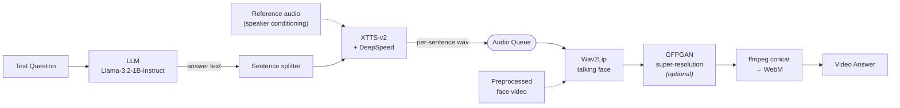

<div align="center">

# Fast TTS API

### Real-time Interactive Talking Face — LLM → TTS → Wav2Lip → Super-Resolution

A FastAPI serving pipeline that turns a text question into a **lip-synced talking-face video**
of a cloned speaker, streaming sentence-by-sentence so synthesis and video generation overlap.

[](https://www.python.org/)
[](https://fastapi.tiangolo.com/)
[](https://pytorch.org/)
[](https://developer.nvidia.com/cuda-toolkit)
[](https://www.docker.com/)


**[한국어 README →](README.ko.md)**

</div>

---

## Overview

This repository is the **real-time serving pipeline** behind
*Real-time Interactive Talking Face System with Integrated LLM and TTS*,
presented at the Virtual Convergence Symposium (Aug 2025) by
IRIS Lab, Graduate School of Advanced Imaging Science, Multimedia & Film, Chung-Ang University —
an industry–academic collaboration with **Genesis Lab**.

The application target was an **interactive digital human** that answers visitor questions at a
fashion exhibition: it had to reproduce not only a person's appearance and voice, but respond
**in real time**, which is what makes the latency work below the core of the project.

```
Question  →  LLM  →  Answer text  →  TTS (cloned voice)  →  Talking Face  →  SR  →  Video answer
```

## Architecture



## The core problem: latency

A naive implementation runs the stages back to back — the user waits for **every** sentence to be
synthesized before video generation even starts. Total latency is the *sum* of both stages, and it
grows linearly with answer length.

`main_refine_parallel.py` restructures this into a **sentence-level producer–consumer pipeline**.
A TTS worker thread pushes each finished sentence onto a queue; the Wav2Lip consumer picks up
sentence *n* while the TTS worker is already synthesizing sentence *n+1*.

```
Sequential  (main_refine.py)
  LLM  ██
  TTS      ████ ████ ████ ████
  W2L                          ████ ████ ████ ████
                                                   ▲ response

Parallel    (main_refine_parallel.py)
  LLM  ██
  TTS      ████ ████ ████ ████
  W2L           ████ ████ ████ ████
                                    ▲ response
```

Wall-clock time drops from `TTS_total + W2L_total` toward `max(TTS_total, W2L_total) + one tail
segment`. The two stages sit on different resources — XTTS on the local GPU, Wav2Lip behind a
remote API — so overlapping them costs nothing and the gain grows with answer length.

Implementation details that matter:

| Concern | Approach |
|---|---|
| Blocking calls in an async server | `run_in_executor` for the Wav2Lip consumer, a `Thread` for the TTS producer — the event loop stays free |
| Stream termination | A `(None, None)` sentinel closes the queue so the consumer knows when to concatenate |
| XTTS inference speed | `use_deepspeed=True` on checkpoint load |
| Speaker identity | Conditioning latents computed once at startup from **multiple** reference clips, reused for every request |
| Browser playback | `ffmpeg` concat of per-sentence MP4s, then WebM (libvpx) transcode |

## API

| Endpoint | Method | Description |
|---|:--:|---|
| `/` | GET | Web interface (Jinja2 template) |
| `/health` | GET | Readiness check — 503 until models finish loading |
| `/tts` | POST | Question → talking-face video |

<details>
<summary><b>POST /tts</b></summary>

**Request**

```json
{
  "text": "How are you today?",
  "language": "en",
  "super_resolution": false
}
```

`language` accepts the 16 XTTS-v2 locales (`en`, `ko`, `ja`, `zh-cn`, `es`, `fr`, `de`, `it`,
`pt`, `pl`, `tr`, `ru`, `nl`, `cs`, `ar`, `hi`).

**Response**

```json
{
  "status": "success",
  "video_url": "/outputs/result_1724220000.mp4",
  "llm_response": "I'm doing great, thanks for asking!",
  "processing_times": { "llm": 0.41, "wav2lip": 3.87, "total": 4.28 }
}
```

Per-stage timings are returned on every call, so the sequential and parallel servers can be
compared directly on your own hardware.

</details>

## Server variants

| Entry point | Pipeline | Use |
|---|---|---|
| `main.py` | Full server with web UI and streaming endpoints | Original implementation |
| `main_refine.py` | Sequential: LLM → full TTS → full Wav2Lip | Baseline for latency comparison |
| `main_refine_parallel.py` | **Parallel**: sentence-level producer–consumer | Recommended |

## Getting started

### Docker

```bash
docker build -t fast-tts-api .
docker run --gpus all -p 8000:8000 -e HF_TOKEN=<your_hf_token> fast-tts-api
```

`HF_TOKEN` is required — the image logs into Hugging Face at startup to pull the gated
Llama-3.2 weights. XTTS-v2 is downloaded automatically on first run.

### Local

```bash
pip install -r requirements.txt
huggingface-cli login
python main_refine_parallel.py          # serves on :8000
```

Then open `http://localhost:8000`.

### Requirements

- Python 3.10+, CUDA 12.1+ GPU
- `ffmpeg` built with `libvpx` (WebM output)
- A reachable **Wav2Lip inference API** — set `WAV2LIP_API_URL` in `utils_parallel/utils.py`.
  This repository serves the orchestration layer; the talking-face model runs as a separate service.

## Project structure

```
fast-tts-api/
├── main.py                      # full server (web UI + streaming)
├── main_refine.py               # sequential baseline
├── main_refine_parallel.py      # parallel producer–consumer server
├── utils/                       # configs for the sequential path
│   ├── llm_config.py                # Llama loading & prompt assembly
│   ├── xtts_config.py               # XTTS init, speaker conditioning, synthesis
│   ├── wav2lip_config.py            # Wav2Lip API client
│   └── utils.py                     # logging, paths, WebM conversion
├── utils_parallel/              # configs for the parallel path
│   ├── xtts_config.py               # queue-producing synthesis
│   └── wav2lip_config.py            # queue-consuming video generation + ffmpeg concat
├── client.py / wav2lip_client.py    # request clients
├── templates/index.html         # web interface
├── input/                       # sample reference audio
└── Dockerfile
```

## Models

| Stage | Model | Reference |
|---|---|---|
| Language | Llama-3.2-1B-Instruct | Meta |
| Speech synthesis | XTTS-v2 | Casanova et al., *XTTS: a Massively Multilingual Zero-Shot Text-to-Speech Model*, **Interspeech 2024** |
| Talking face | Wav2Lip | Prajwal et al., *A Lip Sync Expert Is All You Need for Speech to Lip Generation In the Wild*, **ACM MM 2020** |
| Super-resolution | GFPGAN | Wang et al., **CVPR 2021** |

## Notes

- The Wav2Lip API URL and output paths are set for the lab environment used during development;
  change them before running elsewhere.
- Model weights and generated media are not tracked in this repository.

## Author

**Seungjae Lee** — IRIS Lab, Chung-Ang University
Pipeline design, TTS integration, parallel serving architecture, containerization and deployment.

## License

MIT
